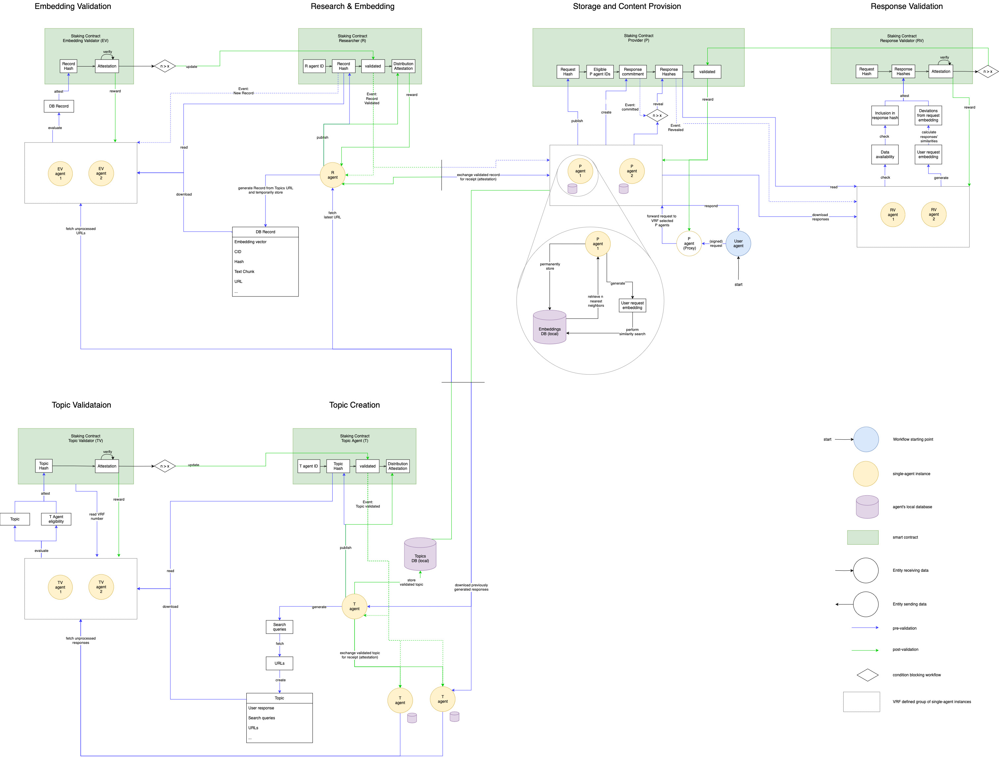

# Eventual Consistency CRDT DB approach
Only viable, if a history-independent conflict-free replicated  data type (CRDT) is used that can efficiently  be synced between peers (such as a prolly tree or geometric search tree).

## Set-up
-   One shared CRDT embeddings database for canonical data structure and efficient syncing among Research Agents
    -	Each agent stores a replica of the whole database
    -   Agents sync this DB periodically with other agents to receive updates and new embeddings
-   One individual graph index over the database per agent for efficient similarity search
    -   A CRDT index for efficient similarity search in a vector DB does not exist
    -   Can be a Hiearachical Navigable Small World index (HNSW)
-   One shared CRDT topics database for canonical data structure and efficient syncing among Topic Agents
    -   Each agent stores a replica of the whole database
    -   Agents sync this DB periodically with other agents to receive updates and new topics

## Storage
-   CRDT database
    -   Represented as a graph, where each node is referenced by a hash that represents its content (see https://docs.dolthub.com/architecture/storage-engine/prolly-tree for prolly tree example)
    -   Stored on disk
-   Search index
    -   The search index is also represented as a graph (see https://arxiv.org/abs/1603.09320 for HNSW example)
    -   Stored in memory

## Syncing
-   Pairwise syncing
    -   When agents sync they only sync the CRDT database and update their individual search index after that
    -   Periodical pairwise syncing ensures up-to-date data even if agents were offline or joined the network later
    -   There is no immediate consensus on a single database root hash. The network reaches eventual consensus after new records are distributed in O(log n) syncing rounds, where n is the number of agents in the network
    -   https://blog.ceramic.network/revolutionizing-data-publishing-why-ceramic-shifted-from-multicast-to-pairwise-synchronization/ 
-   Range-Based Set Reconciliation (RBSR)
    -   Method for efficient computation of the union of two sets over a network
    -   https://arxiv.org/abs/2212.13567 

## Agent Interactions
There are 6 resource intensive operations that have to be performed. The image shows each operation separately managed by a smart contract. Some of them might be combined under a single smart contract. For simplicity, the image does not include the local indexes.

 

### Research & Embedding (Researcher)
-	Fetch latest URL from Topic Agent
-	Scrape URL and chunk content
-	Generate embeddings on content chunks and create a DB record
-	Publish record hash for validation on-chain
-	After validation distribute DB record to other Researchers

### Embedding Validation (Embedding Validator)
-	Download DB record from Researcher
-	Check record against Topic agent URLs
-	Scrape record URL and check content chunks against DB record
-	Generate embeddings from content chunks and check against DB record
-	Attest DB record validity on-chain

### Storage & Content Provision (Provider)
-	Storing
    -   Store all embeddings with text-chunks locally
    -   Sync with other agents periodically
-	Content Provision
    -   Receive and forward user requests
    -   Embed user request
    -   Perform similarity search on local database
    -   Send result to user
    -   Commit to result on-chain
    -   Reveal result on-chain
    -   After validation distribute response to Topic Agents

### Response Validation (Response Validator)
-	Check data availability (download record from Provider)
-	Calculate and verify response hash
-	Generate user request embedding
-	Calculate distances between request embedding and all response embeddings
-	Calculate deviation of distances between provider agents’ responses
-	Attest response validity on-chain

### Topic Creation (Topic Agent)
-	Download previous responses to user requests from Provider
-	Generate search queries that might yield an extended knowledge base based on previous responses
-	Perform search and fetch URLs
-	Store validated topics and URLs locally
-	After validation distribute validated topic to other Topic Agents

### Topic Validation (Topic Validator)
-	Download topic from Topic Agent
-	Fetch unprocessed responses from other Topic Agents
-	Check search queries against unprocessed responses
-	Perform search with search queries and fetch URLs
-	Check URLs against topic URLs
-	Attest topic validity on-chain
